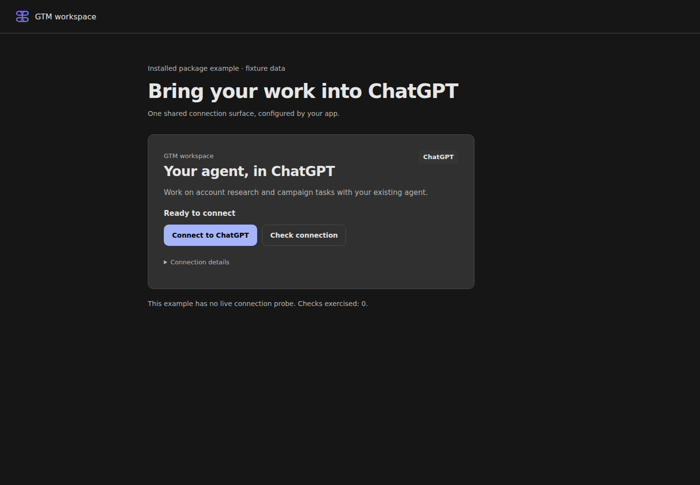
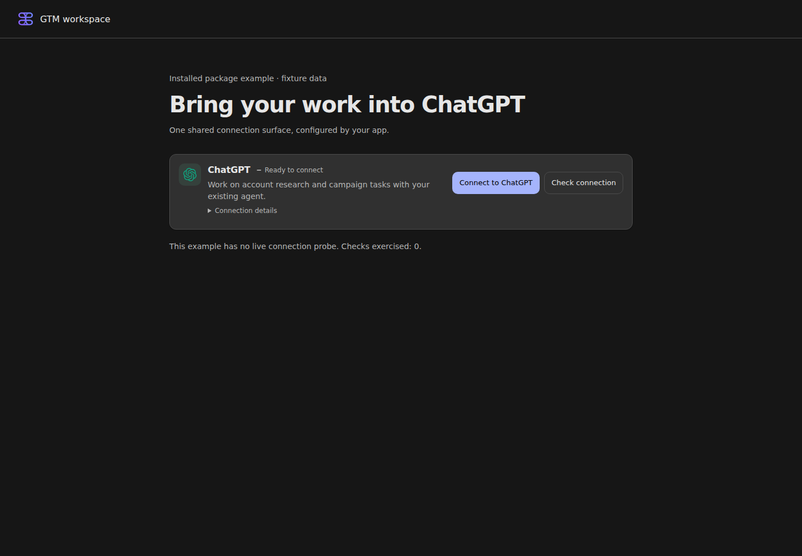
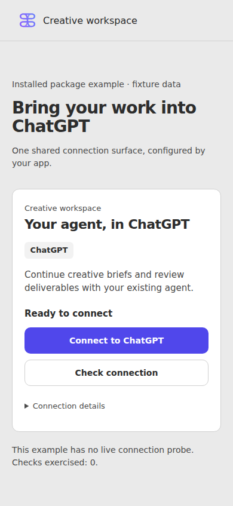
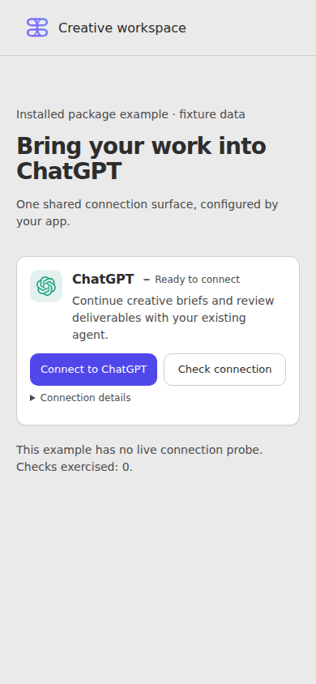
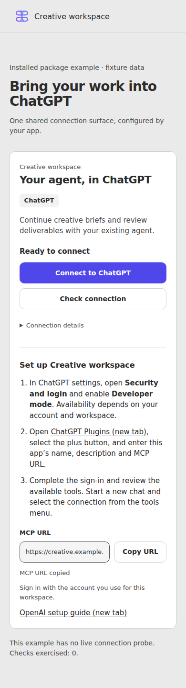
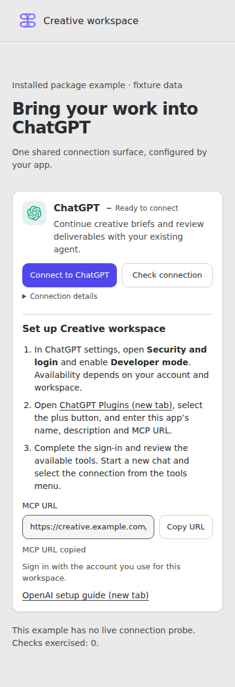

# Compact ChatGPT connection card

The card uses one ChatGPT heading, the shared provider logo and StatusPill, Brand surface/shadow tokens, and existing Button/Input controls.
Its action sits beside the description on wide containers and moves below it in narrow containers.
Connection details and setup remain expandable.
The API, host-confirmed state, URL validation, clipboard behavior, and enrollment scope reset are unchanged.

Source: `eaaf9e495a606ec3f83e3f2c2a15d74815c00963`.
The [receipt](receipt.json) includes exact source hashes and gate outcomes.
The installed candidate tarball still has the base package version; it is not a new public release.
The [installation record](installation.json) retains its archive hash and isolated consumer location.
Packing occurred before the source commit; checked source hashes match the committed files.

Beelink1 merged the current base, then passed frozen install with normal build lifecycle, typecheck, and all 44 affected/component/browser-safe tests.
The installed GTM and Creative examples passed eight viewport/theme combinations with zero Axe violations, runtime errors, or horizontal overflow.
The proof exercised keyboard focus, setup expansion, native details, clipboard, the supplied status callback, error recovery, and host-confirmed connected state.
The closed card measures 136 px on desktop and 209 px on phone in these examples.
Full repository signoff was not repeated for this scoped presentation change.

Baseline captures use the retained installed consumer from `ca46454c`, whose component and CSS are byte-identical to base `5e34b3fa`.
The URLs were `http://127.0.0.1:4401` before and `http://127.0.0.1:4412` after.
Desktop captures use 1440×1000; phone captures use 390×844.
All attached screenshots were opened and inspected, including the expanded setup in both themes.
Raw browser artifacts remain at `beelink1-wsl:/tmp/chatgpt-compact-20261003`.

| State | Before | After |
| --- | --- | --- |
| Desktop, dark, closed |  |  |
| Phone, light, closed |  |  |
| Phone, light, setup open |  |  |

[Desktop light setup](after/gtm-light-1440-setup.png) and [phone dark setup](after/creative-dark-390-setup.png) show the complementary themes.
These are installed package fixtures, not a hosted ChatGPT connection or served Builder acceptance.
Root coordinates the App publication; the Builder enrollment owner handles the consumer pin and plain-language description.
Rollback uses the prior package pin.

Recovery merged base `e2caa96b` (Vault controls and release metadata) without a source conflict.
The [refreshed Beelink gate](recovered-gate.json) passed frozen install, typecheck, eight component tests, and 36 browser-safe export tests.
The card and example sources remain byte-identical to `eaaf9e49`, so the installed browser evidence is retained.
An independent reviewer inspected the complete JSX/CSS diff, unchanged state paths, and desktop/mobile screenshots with no findings.
