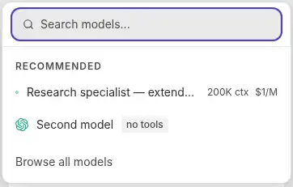
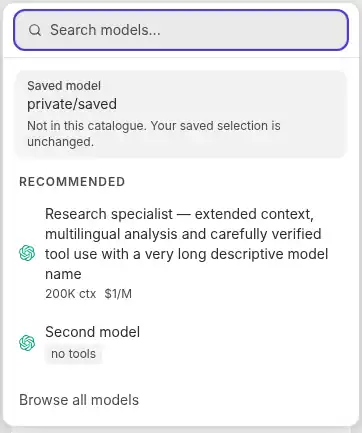

# ModelPicker recovery and focus — executed evidence

PR: [agent-app #761](https://github.com/tangle-network/agent-app/pull/761). Recorded 2026-10-02.

## Before / after browser captures

These are cropped Chromium screenshots, not mockups. Both use the same catalogue fixture and retained `private/saved` value, at a 390 × 844 CSS-pixel viewport in the light theme. The after capture is from the **actual PR CI-built Storybook artifact**. Full-frame captures, including desktop/dark/failure/locked composition, and the executable offline proof are also supplied with the delivery's evidence archive.

### Before — main artifact, `cc0dd5fec9340861fc9c57be63cb83c82125a1ed`



### After — PR source `68d6455c9e160e0c181d352872305f0d21b6d546`



Only cropping and WebP compression were applied. Original crops retain their native 362-pixel width. Image blob hashes were checked against the captured files before committing.

## Executed browser checks

**14/14 passed, zero browser console errors** against the downloaded PR build. The [machine-readable result](./recovery-browser-results.json) records the exact artifact and source provenance.

| Check | Observed result |
| --- | --- |
| Native Enter selection | Exact selected ID emitted once; dialog closed; trigger regained focus. |
| Arrow navigation / Escape / Tab | Search and native buttons navigated; Escape returned focus; Shift+Tab exited to the trigger; forward Tab after the last button reached the next host control. |
| Loading / failure / retry / empty / no matches | Distinct messages and controls; retry callback once; host changed loading/error/data; query and saved ID retained; explicit pointer choice alone changed value. |
| Disabled | Native disabled trigger; disabling while open dismissed the panel without changing the value. |
| Compact Search associations / Space | Actual trigger had the host label and help plus selected-value description; dialog association resolved; native Space selected once and restored focus. |
| Async geometry | Loading-to-results growth and results-to-no-matches shrink remained anchored and within the viewport. |
| Desktop light, desktop dark, phone light, phone dark (4 checks) | Full long row names, provider presentation, metadata and failure controls; no horizontal document/panel overflow; screenshots captured. |
| Installed compact, quiet, locked-harness composition in all four viewport/theme combinations (4 checks) | Actual compiled `AgentSessionControls` composed the picker. Choosing the Anthropic fixture retained the locked Codex harness and emitted no harness-change callback; the locked trigger exposed its reason on focus. |

Desktop: 1280 × 900. Phone: 390 × 844. Chromium was driven by Python Playwright. This is browser viewport coverage, not physical-device acceptance.

### Negative control

The original maintained picker **failed the selection-focus assertion**, as expected: after Enter selection, focus was not on the trigger. The changed source passed the same assertion. The initial source-level run completed 15/15 checks including this expected-failure control; the later 14-check run above retested the positive cases against the actual CI artifact. These are not 29 distinct acceptance scenarios.

## Provenance and execution method

- Initially inspected main: `4b9d4b87e20c87a437cc4f4732f897b0e925c4b1`.
- Main baseline source artifact: `cc0dd5fec9340861fc9c57be63cb83c82125a1ed`, run [37060842857](https://github.com/tangle-network/agent-app/actions/runs/37060842857), artifact `11250316461`.
- PR build: source head `68d6455c9e160e0c181d352872305f0d21b6d546`, GitHub merge ref `eb0fc29843aea96e9d82c8cfb4913d11c32cce8c`, run [37066009538](https://github.com/tangle-network/agent-app/actions/runs/37066009538), artifact `11252542035` (`agent-app-catalog-pr-761`).
- Tested controls blob: `a52c4e0681bdaae6733beedcb7105d4336961649`; SHA-256 `2a24fe4811b1aa84231284f7e83529b91e43f90a2b336fe6961860f70d02d585`.
- The evidence-only commit adds this report, receipt and screenshots; it does not alter the tested product source.

Direct cloning failed with `Could not resolve host: github.com`. Browser URL navigation was blocked with `net::ERR_BLOCKED_BY_ADMINISTRATOR`. GitHub connector reads, artifact downloads, branch and commit writes succeeded. The downloaded Storybook modules were packaged offline as CommonJS and injected through Playwright's page-content API. The tested React 19.2.8 runtime, provider rendering, catalogue functions, theme CSS and installed `AgentSessionControls` composition came from the real artifacts. Component logic was not replaced by a test implementation. A controlled host fixture supplied catalogue state and callbacks without network requests.

## CI checks actually executed

The PR's component-catalog run succeeded. Its logs show:

1. `pnpm install --frozen-lockfile`.
2. Existing postinstall `husky && tsup`: package ESM and declaration builds succeeded.
3. `pnpm build-storybook`: production Storybook build succeeded.
4. Artifact upload succeeded.

The existing workflow also automatically ran its preview-deployment step. No deployment tool or manual workflow dispatch was requested for this task. No package release was made. Existing non-fatal package export-condition and chunk-size warnings remain; the run is not evidence of a warning-free build.

## Runnable repository checks and untested acceptance

```sh
pnpm exec vitest run tests/web-react/model-picker-trigger.test.tsx tests/web-react/model-picker-state.test.tsx tests/web-react/agent-session-controls.test.ts tests/web-react/popover-escapes-host.test.tsx tests/web-react/popover-canon-source.test.ts
pnpm build-storybook
```

The new Vitest suite and full repository lint/typecheck were **not executed locally**: checkout dependencies could not be installed in the network-restricted environment. The recorded CI job builds the package and Storybook; it does not run Vitest. Successful declaration generation is not a claim that every repository test or typecheck passed.

Manual acceptance still includes real assistive technology and physical devices. Builder's single-request sharing, saved default/allowlist persistence through failure and reload, dependency cutover, duplicate deletion and authenticated task execution remain its separate owner's acceptance gates. The [public cutover contract](../../ui-picker-canon.md#builder-settings-cutover--separate-consumer-owner) specifies that work. Bare `ModelPicker`'s new error/retry/disabled props are not automatically forwarded by the existing `AgentSessionControls` cluster.
