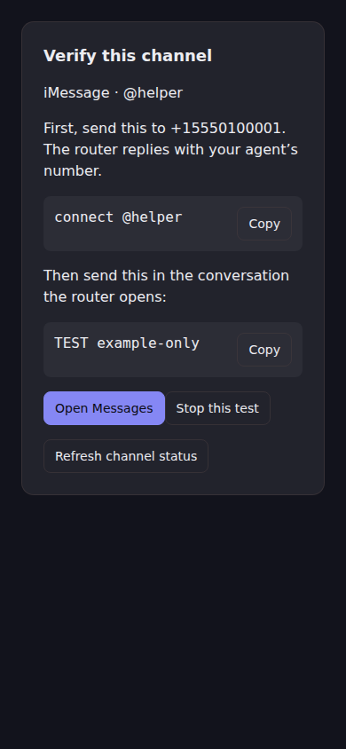
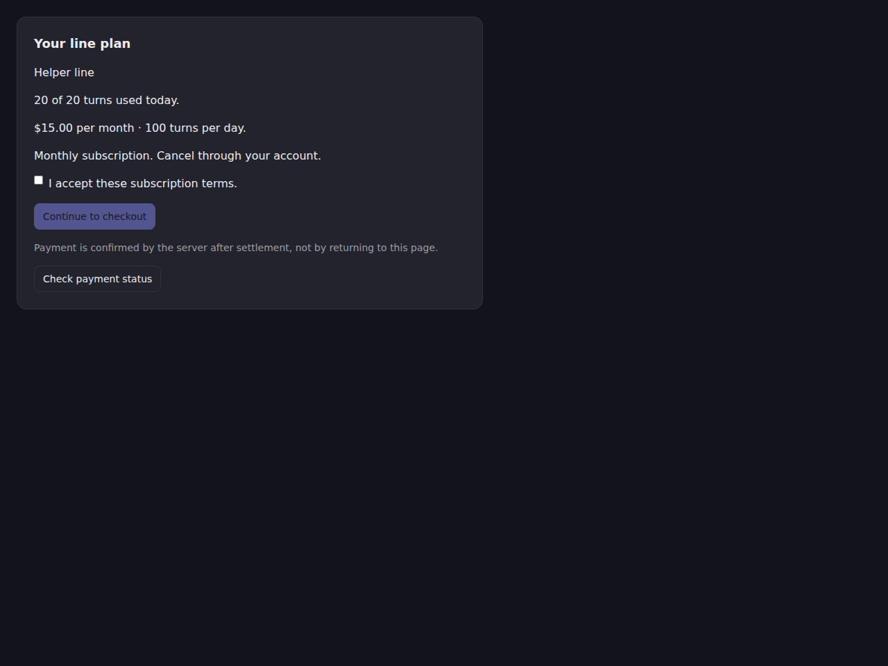

# Channels UI evidence

These are renders of the exported Storybook components, not mockups.
The browser consumes a local bundle of
`src/stories/channels.stories.tsx` and the generated Storybook CSS without a
network request. In the local Chromium 144.0.7559.96 run, all 17 stories were rendered at 390×844 and 1280×960: 34 renders,
no horizontal overflow, no JavaScript page errors. The same SDK-shaped fixtures
are used by the hook and component tests.

Browser interaction checks: selecting an owned WhatsApp number and pressing
Enter connects it and reaches verification; stopping a test requires a second
confirmation and “Keep testing” preserves it; checkout is disabled before terms
consent and returning a checkout link does not grant a paid allowance.

The repository commands are `pnpm typecheck`, `pnpm build`, and
`pnpm test tests/channels` (53 tests). `tests/channels/package.test.ts` imports the
actual built public subpath in a separate Node process. The activation mutation
check is `node scripts/test-channels-mutation.mjs`: removing the guard fails its
test, and restoring it passes. The 23 peer-floor tests also exercise the merged
Runtime 0.266 / Sandbox 0.52 compatibility window rather than retaining the old
“next minor” assertions. Execution logs for the final revision are retained by
Verify PR's artifact, not inferred from screenshots.

No live provider messages, customer purchases, payment settlements, or deployed
Builder replacement were performed. The host remains responsible for
session-scoped authorization, delivery evidence, existing hosted-agent wiring,
and settlement. UI and fake-client tests are not evidence of those deployments.
