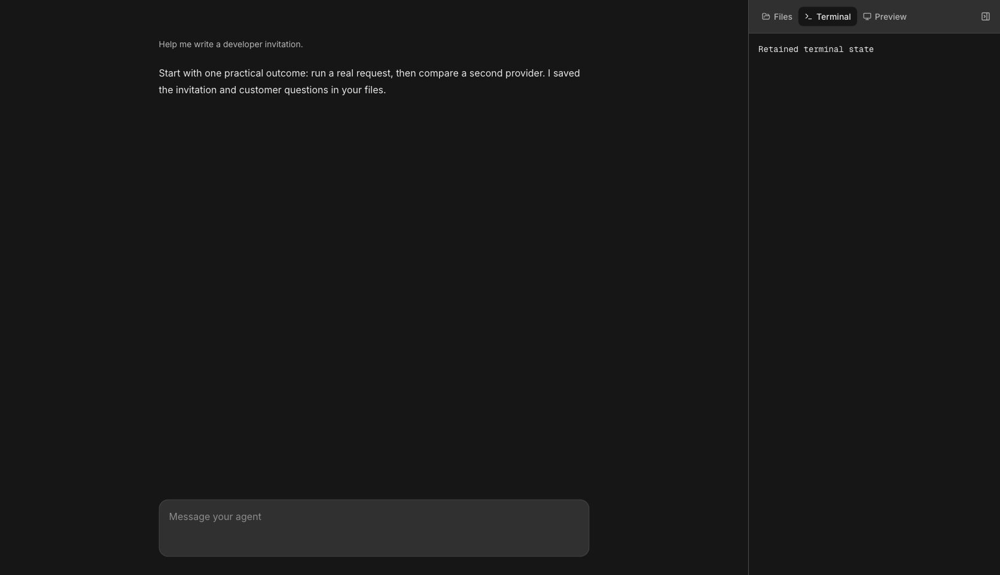

# Workspace companion defaults

Apps now provide tool content through `tools` instead of repeating tab labels, icons, ordering, and retention policy.
Custom `tabs` remain available.
An optional session rail shares the same responsive layout.

## Checked source behavior

The Beelink gate passed frozen installation, repository typecheck, build, and 16 companion and SSR tests.
The previous Sandbox UI 0.117.0 cohort passed 15 tests before the additional navigation regression was added.
The current cohort uses public Sandbox UI 0.119.0 and UI 11.15.1.
Disabling preset retention caused the new terminal state test to fail; restoring it passed.
Tests cover capability omission, controlled and remembered selection, keyboard navigation, pane closure, terminal retention, and one mobile drawer.

## Browser observation

Target: local Storybook `workspace-companion--expanded`, built from this change.
Chrome showed the Files tree and standard tabs at the normal desktop viewport in dark mode.
Typed `Retained terminal state`, switched to Files, then returned to Terminal.
The same text remained visible.
The screenshot was reopened and inspected.

Chrome disconnected while setting the mobile viewport after this capture.
Mobile visual inspection, light theme, continuous video, and production consumer proof are still outstanding.
This source-package evidence does not certify a deployment of GTM or Sandbox.
