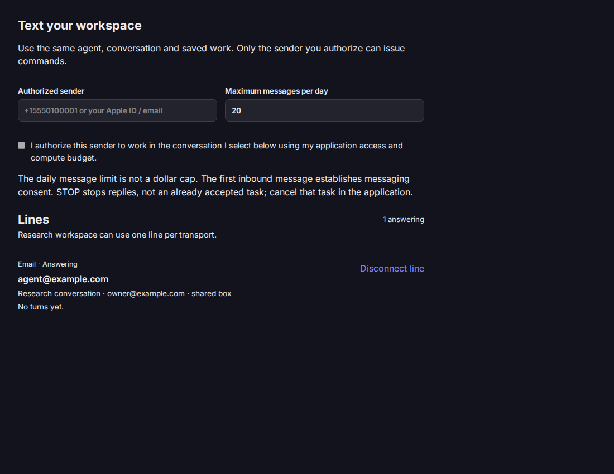
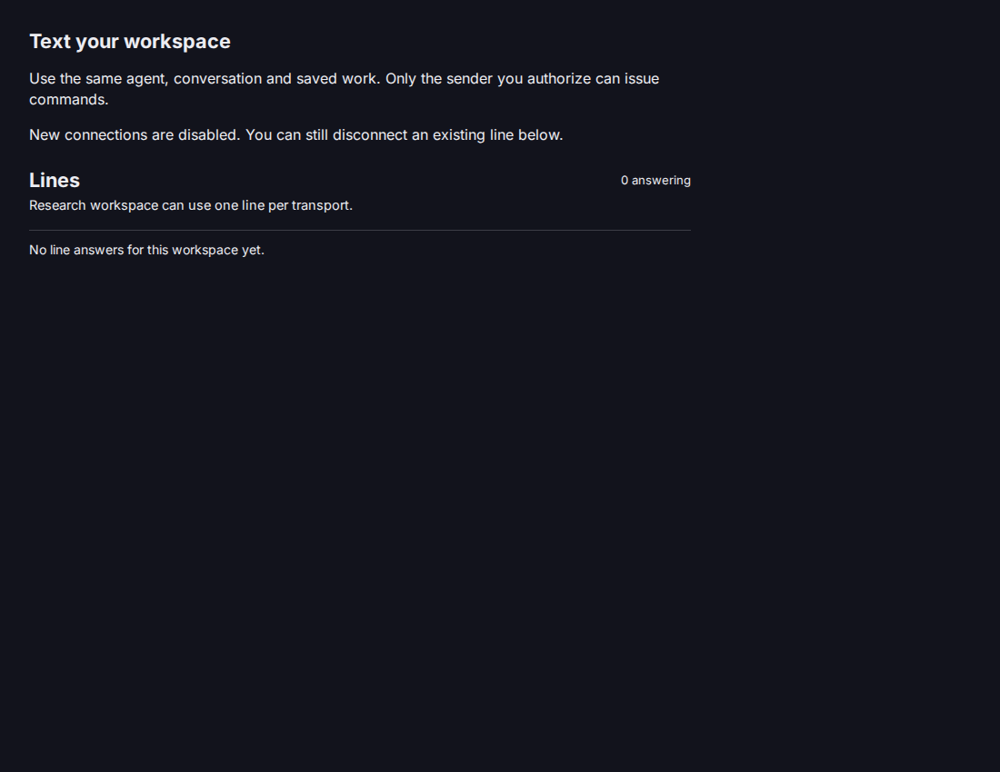
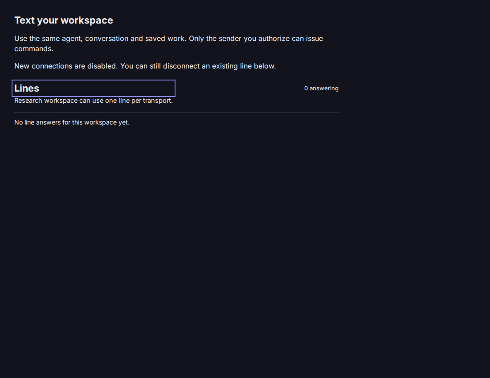

# Application line setup browser proof

The source at `b9abba2c7c46162db457875d9e419b9177785548` ran in Storybook on GTR with Chromium 153.0.8010.12 at 1100 × 850.
The fixture used the source-built Sandbox SDK from agent-dev-container #8499.
It stores one sample line in browser session storage; it does not call Hub or a provider.

In the interactive story, I nominated `owner@example.com`, set eight messages per day, confirmed delegation, and connected the sample mailbox.
I reloaded the browser tab and observed the same answering line and conversation.

I opened the disabled-grants story, disconnected the saved line, and observed the empty state without a connect form.
The disabled state keeps the disconnect action available while the line exists.

This proves the rendered browser flow and browser-session persistence of the fixture.
It does not prove a native attachment, live provider delivery, or a completed application task.

## Frozen cohort and import compatibility

Source `38cda421` ran with installed Runtime 0.285.0, Interface 2.14.0, Hub 0.21.0, and Sandbox 0.58.1.
`pnpm install --frozen-lockfile --strict-peer-dependencies --ignore-scripts=false --registry=https://registry.npmjs.org` passed after an npm registry relock.
The source build, typecheck, and four focused application tests passed.

Chromium 153.0.8010.12 opened the source Storybook at 1100 × 850.
Connect was disabled until I entered `owner@example.com`, set eight messages per day, and checked delegation consent.
Connect saved the sample line in session storage.
Reload retained one answering line and the selected research conversation.

The disabled-grants story hid new connection controls and retained the disconnect action.
I opened its confirmation and disconnected with the keyboard.
The fixture removed the saved line, and reload retained the empty state.
The 390 × 844 viewport had no horizontal overflow, and the browser reported no console or page errors.

The same flow ran again on source `5c4b856c` with an [uncut 6.80-second recording](application-line-flow-original.webm).
The [3.48-second playback copy](application-line-flow-2x.mp4) runs at 2× speed and labels authorization, save, reload, disabled-grants disconnect, and empty-state reload.
The [subtitle timing source](application-line-flow-playback.srt) retains those process boundaries.
I opened the playback in Chromium and checked that the video loaded, played, and displayed the disabled-grants frame.

A locally packed candidate from this source had SHA-256 `cdabdcf865dc30979f7a535795f9b66d2a8aaf38152dea27906ec950c0a7702a`.
An installed consumer with Sandbox 0.55.2 failed to import `hosted-agent` before the subpath split because `LINE_APPLICATION_REQUEST_MAX_BYTES` was absent.
After the split, the same installed consumer imported `hosted-agent` successfully.
The new `hosted-agent/application` entrypoint imported successfully with Sandbox 0.58.1 and the frozen cohort.
These focused npm consumers used `--legacy-peer-deps` to install only the peers needed for the import check; the source checkout passed a separate strict pnpm install.

The first exact-head signoff at `f20f1e95` found one self-audit test that treated every old Interface option as valid with the installed Runtime 0.285.0.
The corrected test checks each installed pair and keeps the old and new peer windows explicit.
Temporarily changing the dev Interface pin to 2.13.0 made that test fail (`2.13.0 vs ^2.14.0`, one of 24 tests).
Restoring 2.14.0 passed all 24 tests.

Storybook uses session storage and a fixture client.
These checks do not establish native attachment, provider delivery, or a completed customer task.
