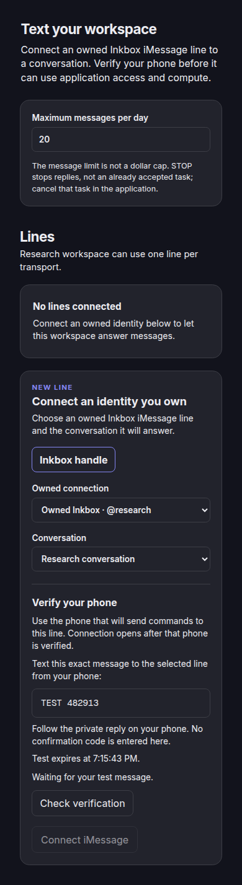
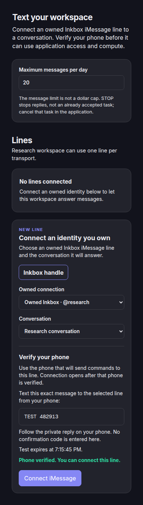
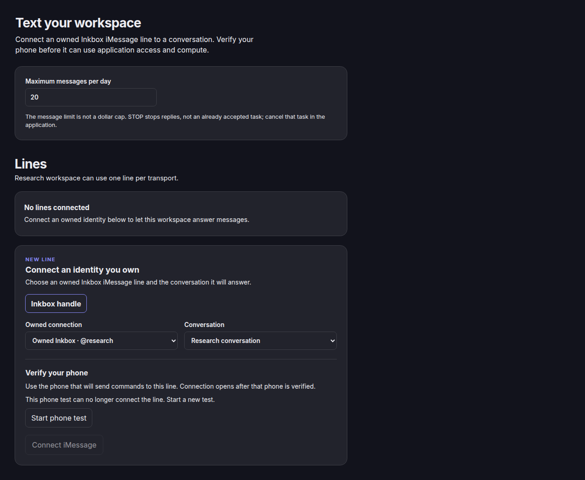
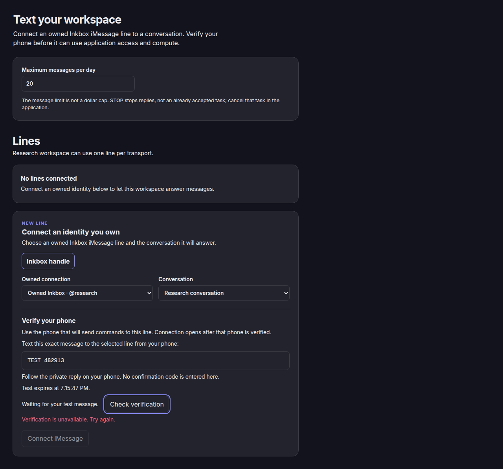

# Application line sender verification browser proof

The Agent App Storybook fixture ran in headless Chrome on GTR at 1280 × 800 and 390 × 844.
It uses a mock owned Inkbox iMessage line and browser session storage.
It does not contact Hub, Platform, Inkbox, or a handset.

The waiting state shows only the public TEST message.
The private confirmation and approved sender remain outside page state.

The interactive story started TEST by keyboard and checked status by pointer.
Connect stayed disabled through `challenge_sent` and opened after the complete verified proof.
It saved the attachment, reloaded it from session storage, and disconnected it.
The verified state stayed within the 390 px viewport without horizontal overflow.

An expired test offered a new test and kept Connect disabled.
A failed status request showed a retryable error and kept Connect disabled.
Both states stayed within the 1280 px viewport without horizontal overflow.

The browser reported no page exceptions or failed application requests.
Storybook's development server returned 404 for `/favicon.ico`; this did not affect the component.
These checks prove the rendered fixture flow and browser-session persistence.
Native attachment, provider delivery, and a real handset require separate served proof.
