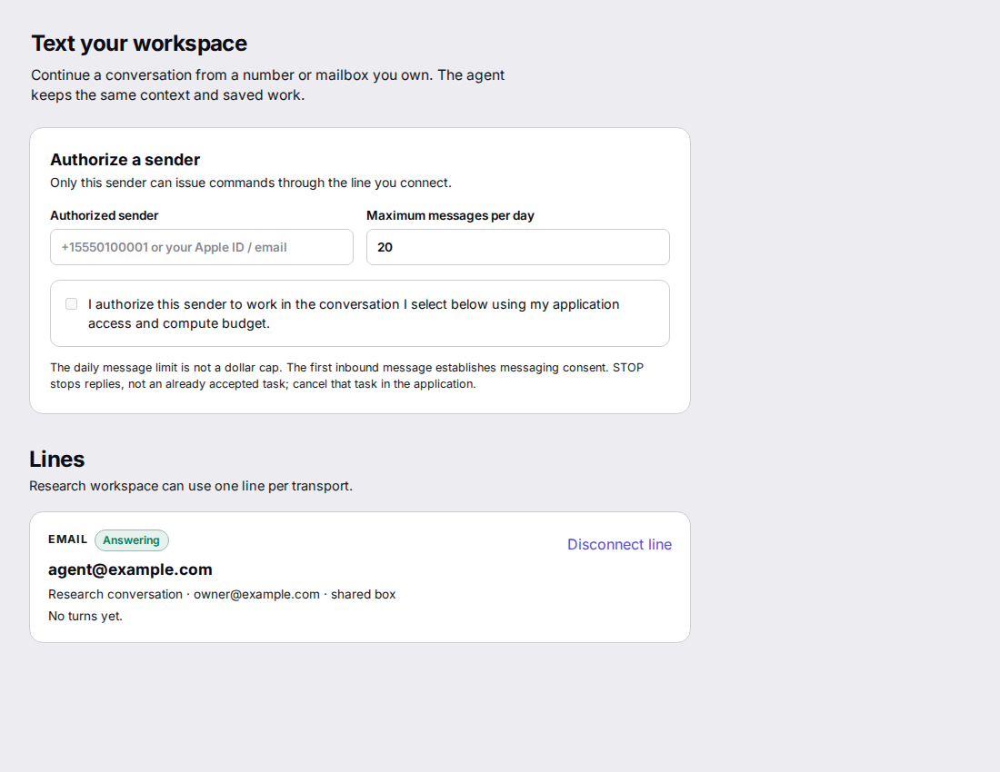
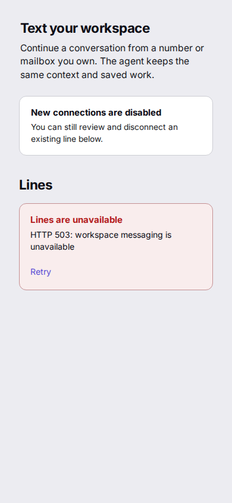

# Application line visual proof

Source `48698151` rendered in Agent App Storybook on GTR with Chromium 153.0.8010.12.
The interactive story uses browser session storage and fixture clients.
It makes no Hub, provider, or native line write.
The stylesheet uses the host's MD3 panel tokens and retains fallbacks for other hosts.

The prior source used a text-only heading, thin dividers, and a narrow error outline.
The [prior connected screenshot](application-line-reopened-cohort.png) shows that starting point.
The [new connected screenshot](application-line-ui-reloaded.png) shows a distinct sender grant, line state, and identity row after reload.

At 1440 × 900, the empty and unconfirmed state kept Connect disabled.
At 390 × 844, disabled grants plus HTTP 503 showed a retryable error without a false connected state.
The no-identity state guided the user to connect an owned identity in Hub.
All three views had no horizontal overflow or browser page errors.

The [uncut 7.32-second video](application-line-ui-flow-original.webm) records authorization, connection, reload, disabled-grant disconnect by keyboard, and empty-state reload.
The [3.76-second playback copy](application-line-ui-flow-2x.mp4) runs at 2× speed with process boundaries from the [subtitle source](application-line-ui-flow-playback.srt).
I opened the playback in Chromium and observed the saved line and disabled-grant frame.
The browser flow reported zero console and page errors.

`pnpm install --frozen-lockfile --strict-peer-dependencies` passed with the frozen Runtime 0.285.0, Interface 2.14.0, Hub 0.21.0, and Sandbox 0.58.1 cohort.
`pnpm typecheck` passed.
The focused application test passed after the visual copy changed.
Changing the empty heading to a wrong state made that test fail; restoring it passed.

These checks prove the rendered component and fixture persistence.
They do not prove a live provider attachment or messaging delivery.
