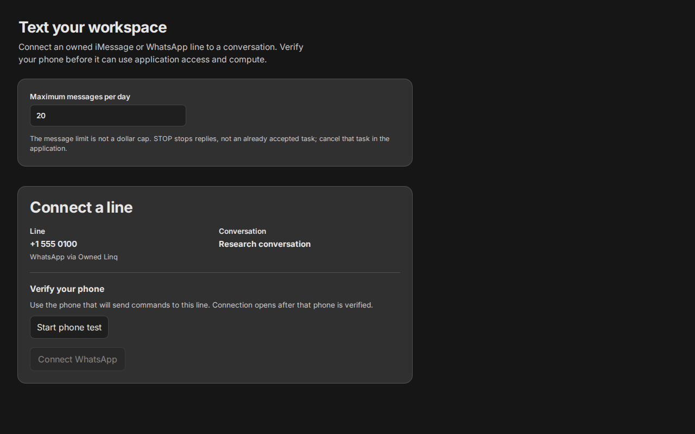
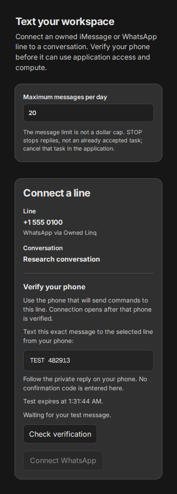
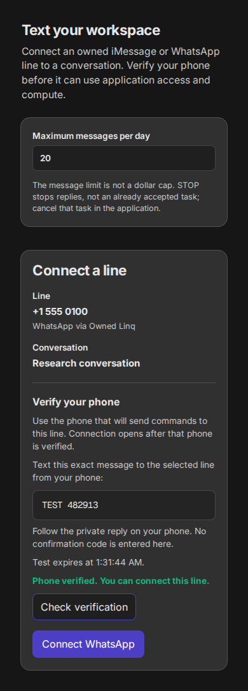

# Application line WhatsApp browser proof

The `WhatsAppInteractive` Storybook fixture ran in headless Chromium at 1280 × 800
and 390 × 844. It models an owned Linq WhatsApp number and an unsupported
WhatsApp provider. The UI offered only the owned Linq number.

Keyboard Enter started TEST. Connect stayed disabled while waiting for the
message and while the mock private confirmation was pending. Pointer clicks
checked status; Connect opened only after the complete verified proof.

Pointer interaction connected the line, a page reload restored its attachment
from browser session storage, and Disconnect removed it. The 390 px viewport had
no horizontal overflow, page exceptions, or console errors.

This fixture does not contact Hub, Linq, or a handset. Native GTM must separately
prove authenticated inventory, TEST delivery, sender confirmation, and attach
on its served route before enabling the provider flag.
