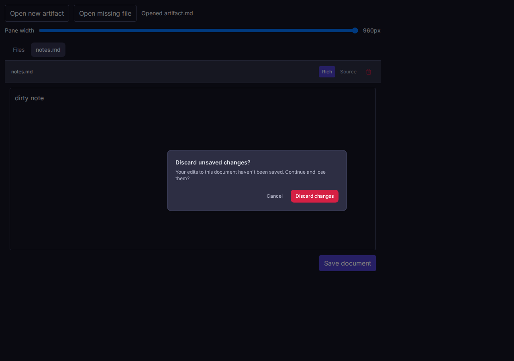
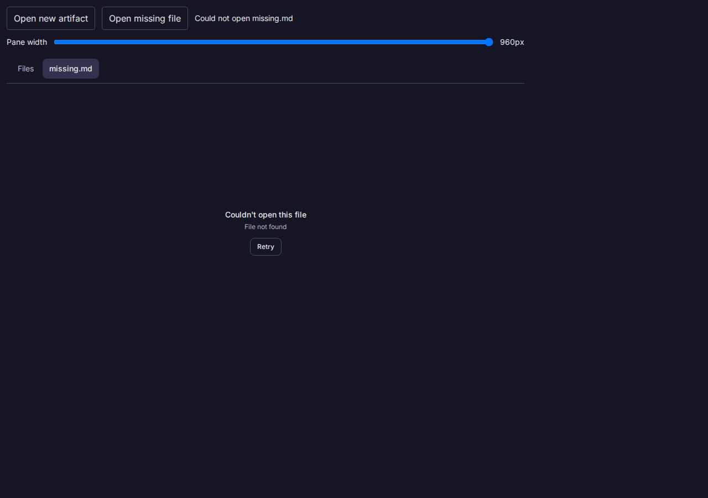
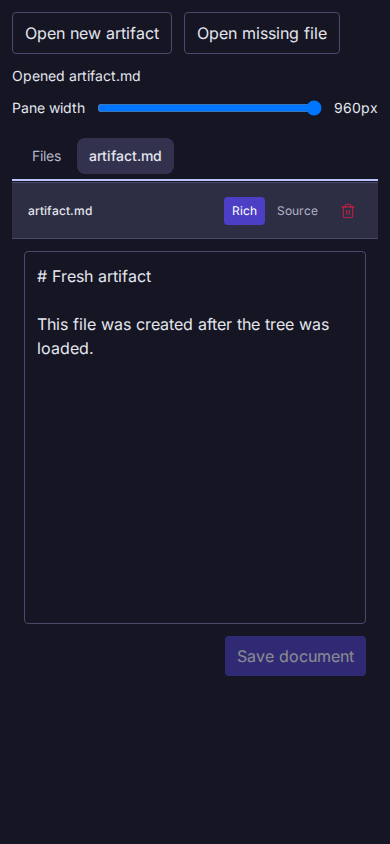

# Vault external navigation completion

Source: the App commit containing this file.
Target: the built `ExternalFileNavigation` Storybook fixture, served locally in Chromium at 1280 × 900 and 390 × 844.
The fixture uses an in-memory data port, so this proof does not cover backend persistence or GTM fragment routing.

At 1280 px, a pointer click created `artifact.md` and `openFile` reported success after its content appeared in the editor.
With unsaved edits in `notes.md`, navigation opened the existing discard dialog.
Cancel reported failure and preserved the exact draft `dirty note`.
The next attempt confirmed discard, loaded `artifact.md`, and reported success.
Opening `missing.md` reported failure and showed the file read error.
Chromium reported zero page errors.

At 390 px, keyboard Enter opened `artifact.md` and reported success after its content appeared.
The document width stayed 390 px, with no horizontal overflow or page errors.

The focused Vault test suite passed 55/55 after seven new completion cases first failed against the old `void` handle.
A later regression case also failed against the first Promise implementation: its dirty dialog stayed actionable after timeout.
The corrected suite covers that dialog and a late read response after timeout.
Typecheck, docs freshness, package build, and Storybook build passed.

