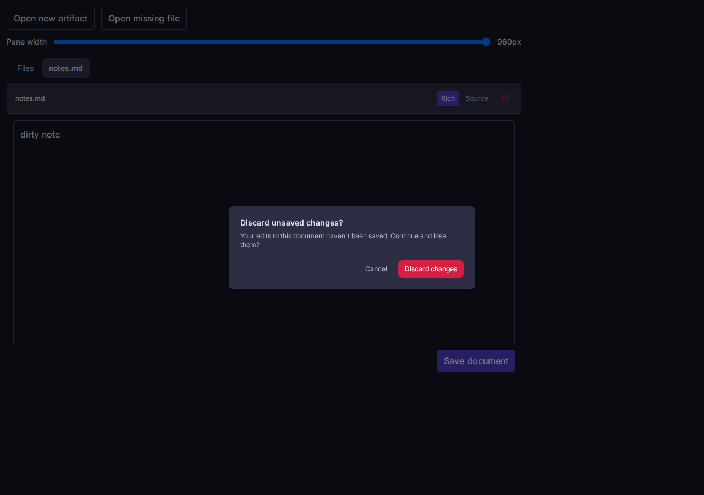

# Vault external navigation completion

Source: the App commit containing this file.
Target: the built `ExternalFileNavigation` Storybook fixture, served locally in Chromium at 1280 × 900 and 390 × 844.
The fixture uses an in-memory data port, so this proof does not cover backend persistence or GTM fragment routing.

At 1280 px, a pointer click created `artifact.md` and `openFile` reported success after its content appeared in the editor.
With unsaved edits in `notes.md`, navigation opened the existing discard dialog.
Cancel reported failure and preserved the exact draft `dirty note`.
The next attempt confirmed discard, loaded `artifact.md`, and reported success.
Opening `missing.md` reported failure and showed the file read error.
Chromium reported zero page errors.

At 390 px, keyboard Enter opened `artifact.md` and reported success after its content appeared.
The document width stayed 390 px, with no horizontal overflow or page errors.

On the rebuilt Storybook fixture, Chromium opened a dirty confirmation and Playwright advanced the page clock by 31 seconds.
The dialog remained visible with the unsaved `dirty note` behind it.
Clicking Discard then displayed the new artifact and reported success.
At 390 px the document and viewport were both 390 px, with zero page errors.

The focused Vault test suite passed 60/60 after seven completion cases first failed against the old `void` handle.
Against the first Promise implementation, six changed checks failed: an initial effect canceled a request before its read completed; controlled rejection remained pending; a dirty prompt disappeared after 30 seconds; a slow read was canceled after 30 seconds; an invalid request canceled a valid read; and rejection after dirty confirmation discarded the draft.
Two further checks failed against the first corrected head: after initial tree listing failed, an explicit path and an already selected explicit path never reached `readFile`.
The corrected pane asks the data port to read an explicit external path while the tree error remains visible.
The corrected pane has no UI deadline for human confirmation or data-port reads.
The data port owns read timeouts and reports failures through its existing error path.
Controlled hosts may explicitly reject a selection by returning `false` from `onSelectedPathChange`.
The public App development cohort uses published Brand 1.9.0 and UI 11.11.5, whose strict peer check passes.
Typecheck, docs freshness, package build, and Storybook build passed.

