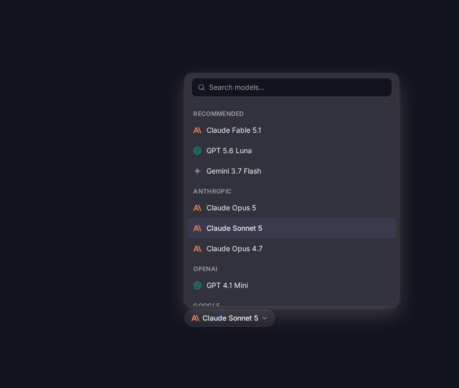

# UI picker canon — one model/effort/harness picker for the ecosystem

Model/effort/harness picking has exactly one canonical implementation:
`ModelPicker`, `EffortPicker`, and `AgentSessionControls` from
`@tangle-network/agent-app/web-react`.

sandbox-ui's `dashboard/ModelPicker` and the model menu in
`chat/AgentSessionControls` are **legacy** — deprecated, frozen, and removed at
sandbox-ui's next major. agent-app's `/chat-react` `ComposerAgentControls`
adapter over that legacy strip is **removed**: it no longer exists, and
`EntryComposer`'s `agent` prop now takes the canonical
`AgentSessionControlsProps` directly. The props mapping below is the migration
path for any product still holding the old nested selection shape.

## Boundary

- **sandbox-ui owns rendering primitives** — terminal, code surface, session
  chrome primitives.
- **agent-app owns composed, seam-driven app-shell surfaces** — transcript,
  composer controls, pickers, assistant.
- **`@tangle-network/ui` owns the run-row grammar** — `RunRowShell`,
  `InlineToolItem`, `InlineThinkingItem` (tool calls, reasoning, status rows).
  Compose it; never re-fork a row type locally. agent-app's `ChatMessages`
  renders the agent-chat WIRE surface (proposals, approvals, missions,
  interactions, quiet chrome) — a different data model from ui's
  session-transcript (`MessageList`/`AgentTimeline`), so the transcript shell
  stays here while every row IN it defers to the ui grammar. If the shell
  can't carry a behavior, extend it upstream (`title` is `ReactNode` and the
  shell itself is exported for this reason).

If you are about to add a picker/menu/control to sandbox-ui, stop — it belongs
in agent-app. Note the one deliberate asymmetry: the assistant dock composer
renders a **bare `ModelPicker`** by design — the assistant wire has no harness
field, so no harness or effort control belongs there.

## Freshness ordering

`ModelPicker` sorts the live catalog by provider and release generation before it renders any section.
The newest stable release appears before older models, even when a caller sends stale order or stale `featured` flags.
The Recommended section contains at most three current provider leaders.
Every other routeable chat model remains available in its provider group and through search.
The product's configured default does not change when display order changes.



## Migration: sandbox-ui → agent-app canon

### `ModelPicker` (sandbox-ui `dashboard/ModelPicker` → `agent-app/web-react` `ModelPicker`)

| sandbox-ui prop | agent-app prop | Notes |
| --- | --- | --- |
| `value: string` | `value: string` | Same contract: the canonical provider-prefixed id (`anthropic/claude-…`). |
| `onChange(modelId)` | `onChange(id)` | Same — the canonical id comes back. |
| `models: ModelInfo[]` | `models: CatalogModel[]` | Shape change, see below. Build it with `/runtime`'s `fetchModelCatalog` / `buildCatalog`, which emit `CatalogModel[]` directly. |
| `loading?: boolean` | `loading?: boolean` | Same. |
| `recents`, `popular` | `priorityGroup: { label, match }` | The pinned top section is predicate-based instead of id-list-based; `recommendedLabel` renames the featured section. |
| `excludeProviders`, `modalities` | — | Filter the `models` array before passing it (`/runtime` exports `isChatCapableModel` for the chat-surface trim). |
| `variant: "field" \| "pill"` | `variant: "chip" \| "quiet"` | The canon trigger is the pill (`chip`, the default). `quiet` is the borderless 28px text button for a composer whose card already draws the border. There is no form-field variant; compose one in the product if a form genuinely needs it. |
| `side`, `avoidCollisions`, `label`, `placeholder`, `triggerClassName`, `disabled` | — | No equivalents. The canonical popover opens upward from the composer and clamps itself inside the viewport. |
| — | `renderProviderBadge(provider)` | agent-app-only hook: override the provider logo/badge (defaults to `/web-react`'s `ProviderLogo`). |

`ModelInfo` → `CatalogModel` field mapping:

| `ModelInfo` (router wire format) | `CatalogModel` (canon) |
| --- | --- |
| `id` (possibly bare) | `id` — **canonical** `provider/model` (use `canonicalModelId` / `/runtime`'s `normalizeModelId`) |
| `name?` | `name` (required) |
| `_provider` / `provider` | `provider` (required) |
| `pricing.prompt/completion` | `pricing.prompt/completion` (same decimal-string shape) |
| `context_length` | `contextLength` |
| `description` | `description` |
| `featured` | `featured` |
| `supportsReasoning` | `supportsReasoning` (required) |
| — | `supportsTools` (required; drives the "no tools" badge) |
| `architecture`, `logos`, `hostProvider`, `modelLab`, `maxReasoningEffort` | — (not carried; provider branding is derived from `provider`) |

### `AgentSessionControls` (sandbox-ui `chat/AgentSessionControls`, or the removed `/chat-react` `ComposerAgentControls` adapter → `agent-app/web-react` `AgentSessionControls`)

| legacy prop | canonical prop | Notes |
| --- | --- | --- |
| `model: { value, onChange, models, loading, … }` | `model`, `onModelChange`, `models: CatalogModel[]`, `modelsLoading` | Flattened onto the top level. `value` must be the canonical id. `model.disabled`, `model.recents`, `model.popular`, `model.modalities`, `model.excludeProviders` have no equivalent — trim the array before passing. |
| `harness: { value, onChange, available, locked, lockReason, onNewChat, disabled }` | `harness`, `onHarnessChange`, `availableHarnesses` | `Harness` is `/harness`'s union, not sandbox-ui's `HarnessType`. The locked/fork affordance (session pinning) is product state: render the canonical control only while unpinned, or render your own locked chip — the canonical control keeps harness switching live. |
| `reasoning: { value, onChange, available }` | `effort`, `onEffortChange`, `effortLevels` | `effort` is a plain engine-id string (`off`/`low`/`medium`/`high` by default — see `DEFAULT_EFFORT_LEVELS`). **`available` is not `effortLevels` — read the next section before mapping it across.** |
| `layout: "inline" \| "gear" \| "combined"` | `layout: "inline" \| "compact"` | `gear`/`combined` both become `compact` (model inline, harness + effort behind a gear popover with plain-English copy). |
| `context: "chat" \| "all"` | — | No flag: offer only what the surface supports (`availableHarnesses`, pre-filtered `models`). |
| `filterModelsToHarness` | — | No equivalent. The canonical control always enforces coherence both ways via `/harness`'s `snapModelToHarness` / `snapHarnessToModel`. |
| `profile` | — | Agent-profile picking is not part of the canon cluster. |
| `menuPlacement`, `trailing` | — | Menus open upward; extras dock beside the control in your own row. |
| `className` | `className` | Same. |
| — | `variant: "chip" \| "quiet"` | agent-app-only. `chip` (default) is the bordered pill on every child; `quiet` is the borderless text button. Reaches the model, harness, and effort triggers in both layouts. |

### `reasoning.available` → `effortLevels` — the two lists are not the same thing

This is the one mapping in the table that a product can get wrong while
following it exactly, so it gets its own section.

`available` was an **allow-list layered over the picker's own vocabulary**, and
that picker injected the `auto` sentinel itself — which is why `available`
deliberately excluded `auto`. `effortLevels` is the **complete renderable set**,
forwarded verbatim to `EffortPicker`. Map one onto the other and you drop
`auto` from the list while your sessions still run on it.

```ts
// WRONG — the list no longer carries the value the session is on.
effortLevels: available.map((id) => ({ id, label: id })),

// RIGHT — canonical labels, and every value the product can actually hold.
import { effortLevelsFromIds } from '@tangle-network/agent-app/web-react'
effortLevels: effortLevelsFromIds(['auto', ...available]),
```

`effortLevelsFromIds` keeps the canonical vocabulary (`low` → "Quick", `high` →
"Extended") instead of a hand-written label map per product, which is how
"Quick" and "Low" drift apart across two surfaces of the same app.

**A list that still omits the running value is safe, not a wrong label.**
`EffortPicker` reconciles the selected value into the rendered list under its
own name (`reconcileEffortLevels`, labelled by `effortLevelLabel` — `auto` →
"Auto"), so a selected value can never render as a *different* list entry. The
reconciled row draws no strength meter: it has no rung on a ladder it was not
declared on, and an all-ghost meter is what `off` looks like. It leaves every
declared level on the rung it already had, and it disappears as soon as the
user picks a declared level. A blank `effort` renders as no selection (`—`),
never as the middle level.

The guarantee is runtime rather than a type on purpose. A product stores its
effort as a plain `string`, so "`value` is one of `levels`" is not expressible
at the call sites that produce this bug; a generic pairing would bind only at
literal-const call sites and would have caught none of the real ones while
reading as though it caught all of them.

The `ComposerAgentControls` adapter's wiring that products relied on —
canonical-id boundary, harness-snap suppression for per-harness remembered
picks, and the chat-context trim (`cli-base` / non-chat models never offered) —
becomes product-side state when migrating: store per-harness picks yourself and
filter the catalog before passing it. The coherence grammar itself (harness
change snaps the model, model change snaps the harness) is identical in the
canonical component.

## Products still on legacy pickers

Bump to current sandbox-ui, adopt the canon per the mapping above, and delete
the local picker if the product hand-rolled one. The legacy sandbox-ui pickers
receive no further features — frozen means frozen.
