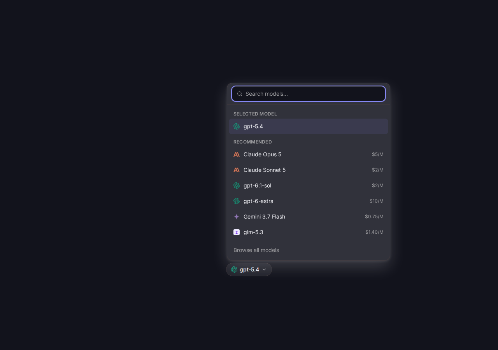
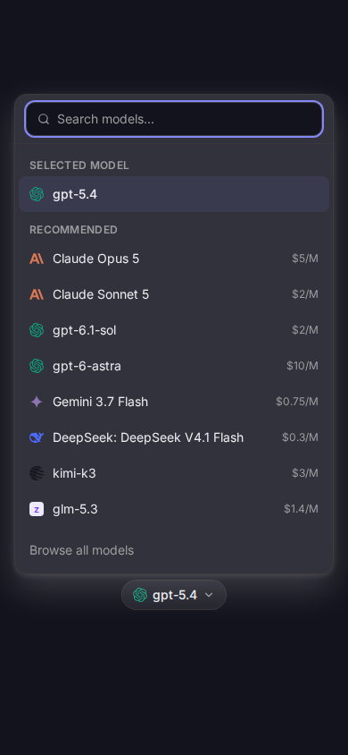

# UI picker canon — one model/effort/harness picker for the ecosystem

Model/effort/harness picking has exactly one canonical implementation:
`ModelPicker`, `EffortPicker`, and `AgentSessionControls` from
`@tangle-network/agent-app/web-react`.

sandbox-ui's `dashboard/ModelPicker` and the model menu in
`chat/AgentSessionControls` are **legacy** — deprecated, frozen, and removed at
sandbox-ui's next major. agent-app's `/chat-react` `ComposerAgentControls`
adapter over that legacy strip is **removed**: it no longer exists, and
`EntryComposer`'s `agent` prop now takes the canonical
`AgentSessionControlsProps` directly. The props mapping below is the migration
path for any product still holding the old nested selection shape.

## Boundary

- **sandbox-ui owns rendering primitives** — terminal, code surface, session
  chrome primitives.
- **agent-app owns composed, seam-driven app-shell surfaces** — transcript,
  composer controls, pickers, assistant.
- **`@tangle-network/ui` owns the run-row grammar** — `RunRowShell`,
  `InlineToolItem`, `InlineThinkingItem` (tool calls, reasoning, status rows).
  Compose it; never re-fork a row type locally. agent-app's `ChatMessages`
  renders the agent-chat WIRE surface (proposals, approvals, missions,
  interactions, quiet chrome) — a different data model from ui's
  session-transcript (`MessageList`/`AgentTimeline`), so the transcript shell
  stays here while every row IN it defers to the ui grammar. If the shell
  can't carry a behavior, extend it upstream (`title` is `ReactNode` and the
  shell itself is exported for this reason).

If you are about to add a picker/menu/control to sandbox-ui, stop — it belongs
in agent-app. Note the one deliberate asymmetry: the assistant dock composer
renders a **bare `ModelPicker`** by design — the assistant wire has no harness
field, so no harness or effort control belongs there.

Explicit effort selections travel in `AgentProfile.model.reasoningEffort`.
`attachReasoningEffort` preserves other model hints and leaves Auto or omitted selections unchanged.
Harness extensions remain reserved for native controls that their provider explicitly handles.

## Current model menu

`ModelPicker` opens with a bounded shortlist from the live Router catalogue.
The catalogue recommends current families that served live probes: GPT 6.1 Sol, GPT 6 Astra, Gemini 3.7 Flash, and GLM 5.3.
The Router response checked on 2026-09-30 contained no release dates in 568 entries.
The catalogue supplements exact IDs with vendor-announced launch dates and applies the 120-day window to them.
A future model without a verified date uses its family version floor; that fallback does not assert a launch month.
An explicitly unavailable route never enters the catalogue, even if its name looks newer.
Opus 5 and Sonnet 5 remain searchable after live quota failures.
Their 5.5 successors enter the shortlist only when Router marks them routeable.

The search field covers every routeable chat model.
"Browse all models" opens provider groups for older and specialty models.
An older selected value remains visible above the shortlist until the user changes it.
A product's configured default does not change when display order changes; without an override, the shared default prefers verified GLM 5.3.
The menu can recommend up to eight models.
The 2026-09-30 Router probe served GLM 5.3 but returned a quota error for DeepSeek V4.1 Flash and an upstream error for Kimi K3.
Those two remain searchable; they can enter the shortlist after the Router serves them successfully.





An editable model field can dock the canonical picker with `variant="quiet"` and `triggerContent={<span>Search</span>}`.
The supplied content names the trigger; the picker retains its dropdown indicator, search, selection, and focus behavior.
Omitting this slot preserves the selected-model label and provider icon.

## Form fields

A settings form uses the same pickers with `variant="field"`: a full-width trigger with the height,
radius, well, and focus treatment of a compact text input, and a menu at least as wide as the field.
`ModelPicker` and `HarnessPicker` take `defaultOption={{ label }}` for a setting that may defer to a
default chosen elsewhere; choosing it calls `onChange('')`. `EffortPicker` represents that case with an
`auto` level. Each takes an `id` so a form label names the trigger. `HarnessPicker` is exported for
this use; the composer cluster still composes it through `AgentSessionControls`.

## Catalogue state and accessible trigger contract

The implementation and public types live in [`controls.tsx`](../src/web-react/controls.tsx).
Import `ModelPicker` from `@tangle-network/agent-app/web-react` and the browser-safe
`CatalogModel` type from `@tangle-network/agent-app/catalog`.

| Prop | Contract |
| --- | --- |
| `value: string`, `onChange: (id: string) => void` | Controlled, opaque saved ID. Only an explicit row selection calls `onChange`, with that row's exact `id`. Opening, searching, retrying, receiving data and changing display order never rewrite the value. |
| `models: CatalogModel[]` | Host-supplied selectable catalogue. The picker does not fetch, cache, normalize IDs, infer permissions or own an allowlist. |
| `loading?: boolean` | A host request is in progress. Takes precedence over error and results. The trigger remains usable to inspect the state and saved value. |
| `error?: string \| null` | A user-safe catalogue failure. `null`/`undefined` means no failure; even an empty string is a failure and receives fallback copy. Stale rows are not offered while failed. |
| `onRetry?: () => void` | A retry request to the host, not a success signal. The host owns loading/error transitions, request deduplication, cancellation and caught promise failures. Omit when retry is not possible. |
| `disabled?: boolean` | Native disabled trigger; dismisses an already-open picker without changing its saved value. Independent of loading and failure. |
| `id`, `aria-label`, `aria-labelledby`, `aria-describedby` | Applied to the actual trigger button. Use `label htmlFor`, or explicit accessible naming, and describe host help/disabled reasons. The trigger owns its expanded state and dialog association. |
| `variant`, `triggerContent`, `renderProviderBadge`, `priorityGroup`, `recommendedLabel` | Existing contracts unchanged. Compact Search and explicitly labelled triggers also describe the selected value to assistive technology. |

State precedence is **loading → unavailable → empty catalogue → filtered results**.
"No models available" means the host successfully supplied an empty array.
"No models match your search" means a nonempty catalogue has zero matches.
A query does not turn an empty or failed catalogue into a search failure.

An absent saved ID remains visible under its own name, with an explanatory
read-only notice in the panel. It is not fabricated as an available choice.
This also preserves native aliases and private IDs used by editable model
fields. Router normalization belongs at the host's data boundary, never in a
render effect over the saved value. The control does not attest that an absent
ID will execute successfully.

The panel is a **non-modal, named dialog with native buttons**, not a partial
combobox/listbox. Opening focuses search. Arrow keys traverse search and the
available buttons; Home/End navigate buttons but keep their text-editing
meaning in search. Enter/Space select. Escape and selection return focus to the
trigger. Shift+Tab from search returns to the trigger; Tab after the last
control leaves beside it, not at the top of the page. Retry focuses the stable
search input before its button can disappear. Dismissal clears the transient
query; retry keeps it. The existing portaled surface reclamps after catalogue
or search height changes, including inside an overflow-clipped composer rail.
Long row names wrap; truncated triggers retain their full accessible text and title.

## Builder Settings cutover — separate consumer owner

Inspected consumer baseline: agent-builder
[`43f25fd`](https://github.com/tangle-network/agent-builder/tree/43f25fdad0c1cfa9c43633165fb72e5c792d0aa9).
`src/routes/app.$agentId.settings.tsx` (`PolicyTab`) uses the local
`src/components/model-picker.tsx` and separately loads the allowlist catalogue.
`src/components/runtime-model-field.tsx` already composes the canonical quiet
Search picker beside an editable input. Keep that installed composition; do
not replace it with another picker or normalize its native IDs.

The Settings adoption owner must replace the local picker with this public
contract, move its catalogue input to the **same host request/state** used by
the allowlist, then delete `src/components/model-picker.tsx` and its duplicate
`CuratedModel` declaration after checking imports. A new shared store, endpoint,
request service, form library or agent-app fetch effect is not required.

Use the existing server contract (`import type` only) rather than inventing
capability fields. Builder's mapping is `label → name`, `contextLength` unchanged,
`pricing.promptUsdPerToken/completionUsdPerToken → pricing.prompt/completion`
as decimal strings, and the actual `supportsTools`/`supportsReasoning` booleans.
Do not infer those booleans from `tier` or a model name. As the installed
`RuntimeModelField` already does, do not offer metadata-incomplete suggestions;
retain their saved IDs. Keep `featured: false` unless the host has an explicit
recommendation policy; `tier` is not proof of freshness. IDs are unchanged for
Settings. The native-runtime mapping remains the native-runtime owner's policy.

```tsx
import { ModelPicker } from '@tangle-network/agent-app/web-react'
import type { CatalogModel } from '@tangle-network/agent-app/catalog'

// These values come from PolicyTab's ONE catalogue request, also used by its
// allowlist. reloadCatalogue handles errors, loading and cancellation there.
// pickerModels is its CatalogModel[] projection; model is the existing saved
// string | null, where null means the host's platform-default policy.
<label htmlFor="settings-model">Default model</label>
<ModelPicker
  id="settings-model"
  aria-describedby="settings-model-help"
  value={model ?? ''}
  onChange={setModel}
  models={pickerModels}
  loading={catalogueLoading}
  error={catalogueError}
  onRetry={() => { void reloadCatalogue() }}
  disabled={saving}
  triggerContent={model === null ? <span>Platform default</span> : undefined}
/>
<p id="settings-model-help">Used for new tasks. Existing saved IDs are retained.</p>
```

Keep `null` as the existing platform-default sentinel; do not persist `''` or
choose the first fetched model as a substitute. A reset-to-default action, when
needed, is a separate host action. Do not hardcode a model family in placeholder
copy. The existing Save operation continues to own persistence.

The allowlist must also distinguish loading/failure/empty and preserve stored
IDs missing from a fresh response. Display those entries as retained values
that the user can explicitly remove; never intersect persisted IDs with the
latest catalogue as an incidental cleanup. One retry refreshes both views.
Consumer acceptance must count requests and prove that Save/reload retains both
the default model and absent allowlist entries through failure and retry.

This shared-module PR does **not** complete Builder adoption or publish a
package. The release owner supplies an installable version; the Builder owner
performs the explicit dependency cutover and product acceptance. Do not upgrade
sandbox-ui merely to adopt this agent-app control.

## Migration: sandbox-ui → agent-app canon

### `ModelPicker` (sandbox-ui `dashboard/ModelPicker` → `agent-app/web-react` `ModelPicker`)

| sandbox-ui prop | agent-app prop | Notes |
| --- | --- | --- |
| `value: string` | `value: string` | Preserve the saved ID. Router-backed hosts supply canonical provider-prefixed catalogue IDs; native editable fields may use their runtime's own IDs. |
| `onChange(modelId)` | `onChange(id)` | The exact selectable row ID comes back; no implicit normalization. |
| `models: ModelInfo[]` | `models: CatalogModel[]` | Shape change, see below. Build Router data with `fetchModelCatalog` / `buildCatalog` at the host's catalogue boundary. |
| `loading?: boolean` | `loading?: boolean` | Same; loading alone does not disable inspection. |
| `disabled?: boolean` | `disabled?: boolean` | Native disabled trigger. Explain the reason with host help and `aria-describedby`. |
| — | `error`, `onRetry` | Host-owned failure and recovery, as specified above. |
| `label` | `id` + host label, or `aria-label` / `aria-labelledby` | Associate the actual trigger, not an enclosing div. `aria-describedby` supplies help. |
| `recents`, `popular` | `priorityGroup: { label, match }` | The pinned top section is predicate-based instead of id-list-based; `recommendedLabel` renames the featured section. |
| `excludeProviders`, `modalities` | — | Filter the `models` array before passing it (`isChatCapableModel` handles the chat-surface trim). Do not filter the persisted value. |
| `variant: "field" \| "pill"` | `variant: "chip" \| "quiet"` | `chip` is the default pill. `quiet` is the borderless 28px text button. Compose existing host form controls when an editable field is needed. |
| `side`, `avoidCollisions`, `placeholder`, `triggerClassName` | — | Placement prefers above, flips when needed and clamps to the viewport. Use `triggerContent` for an intentional compact or unset-value label, not a second menu. |
| — | `renderProviderBadge(provider)` | Override the provider logo/badge; defaults to `/web-react`'s `ProviderLogo`. |

`ModelInfo` → `CatalogModel` field mapping at a Router-backed host's data boundary:

| `ModelInfo` (router wire format) | `CatalogModel` (canon) |
| --- | --- |
| `id` (possibly bare) | `id` — canonical `provider/model` for Router catalogue rows (use `canonicalModelId` / `normalizeModelId` while building the catalogue, not on stored selections) |
| `name?` | `name` (required) |
| `_provider` / `provider` | `provider` (required) |
| `pricing.prompt/completion` | `pricing.prompt/completion` (same decimal-string shape) |
| `context_length` | `contextLength` |
| `description` | `description` |
| `featured` | `featured` |
| `supportsReasoning` | `supportsReasoning` (required) |
| — | `supportsTools` (required; drives the "no tools" badge) |
| `architecture`, `logos`, `hostProvider`, `modelLab`, `maxReasoningEffort` | — (not carried; provider branding is derived from `provider`) |

### `AgentSessionControls` (legacy cluster → `agent-app/web-react`)

| legacy prop | canonical prop | Notes |
| --- | --- | --- |
| `model: { value, onChange, models, loading, … }` | `model`, `onModelChange`, `models: CatalogModel[]`, `modelsLoading` | Flattened. This harness-aware cluster requires canonical IDs. Bare `ModelPicker`'s new `error`, `onRetry`, `disabled` and trigger-association props are not automatically forwarded by this existing cluster. Do not silently assume otherwise. |
| `harness: { value, onChange, available, locked, lockReason, onNewChat, disabled }` | `harness`, `onHarnessChange`, `availableHarnesses`, `harnessLockReason` | Pass `harnessLockReason` while pinned. The existing canonical locked control stays visible and focusable, explains itself on hover/focus, and never calls `onHarnessChange`, including from model coherence. `onNewChat` remains a host action; do not create a local locked chip. |
| `reasoning: { value, onChange, available }` | `effort`, `onEffortChange`, `effortLevels` | `effort` is an engine ID. `available` is not the complete `effortLevels` list; see below. |
| `layout: "inline" \| "gear" \| "combined"` | `layout: "inline" \| "compact"` | `gear`/`combined` become `compact`: model inline, harness + effort behind the existing gear popover. |
| `context: "chat" \| "all"` | — | Offer only what the surface supports through `availableHarnesses` and pre-filtered `models`. |
| `filterModelsToHarness` | — | The cluster enforces coherence through `snapModelToHarness` / `snapHarnessToModel`, except that a pinned harness is authoritative and cannot be changed by a model selection. |
| `profile` | — | Agent-profile picking is not part of the canon cluster. |
| `menuPlacement`, `trailing` | — | Placement is owned by the shared surface; extras dock beside the control. |
| `className` | `className` | Same. |
| — | `variant: "chip" \| "quiet"` | Reaches the model, harness and effort triggers in both layouts. |

### `reasoning.available` → `effortLevels` — the two lists are not the same thing

`available` was an **allow-list layered over the picker's own vocabulary**, and
that picker injected the `auto` sentinel itself — which is why `available`
deliberately excluded `auto`. `effortLevels` is the **complete renderable set**,
forwarded verbatim to `EffortPicker`. Map one onto the other and you drop
`auto` from the list while your sessions still run on it.

```ts
// WRONG — the list no longer carries the value the session is on.
effortLevels: available.map((id) => ({ id, label: id })),

// RIGHT — canonical labels, and every value the product can actually hold.
import { effortLevelsFromIds } from '@tangle-network/agent-app/web-react'
effortLevels: effortLevelsFromIds(['auto', ...available]),
```

`effortLevelsFromIds` keeps the canonical vocabulary (`low` → "Quick", `high` →
"Extended") instead of a hand-written label map per product, which is how
"Quick" and "Low" drift apart across two surfaces of the same app.

**A list that still omits the running value is safe, not a wrong label.**
`EffortPicker` reconciles the selected value into the rendered list under its
own name (`reconcileEffortLevels`, labelled by `effortLevelLabel` — `auto` →
"Auto"), so a selected value can never render as a *different* list entry. The
reconciled row draws no strength meter: it has no rung on a ladder it was not
declared on, and an all-ghost meter is what `off` looks like. It leaves every
declared level on the rung it already had, and it disappears as soon as the
user picks a declared level. A blank `effort` renders as no selection (`—`),
never as the middle level.

The guarantee is runtime rather than a type on purpose. A product stores its
effort as a plain `string`, so "`value` is one of `levels`" is not expressible
at the call sites that produce this bug; a generic pairing would bind only at
literal-const call sites and would have caught none of the real ones while
reading as though it caught all of them.

The removed adapter's canonical-ID boundary, per-harness remembered picks and
chat-context trim become host state when migrating. Store per-harness picks
and filter the catalogue before passing it. The shared cluster retains its
coherence policy; pinning is now expressed through `harnessLockReason`.

## Verification and remaining consumer acceptance

Run the existing trigger tests plus the state/keyboard suite, and the popover
and cluster regressions whenever changing this contract:

```sh
pnpm exec vitest run tests/web-react/model-picker-trigger.test.tsx tests/web-react/model-picker-state.test.tsx tests/web-react/agent-session-controls.test.ts tests/web-react/popover-escapes-host.test.tsx tests/web-react/popover-canon-source.test.ts
pnpm build-storybook
```

The `ChatControls/ModelPicker` stories include Recovery, Unavailable,
EmptyCatalogue, NoSearchMatches, LongModelNames and Disabled alongside the
existing chip, quiet and editable-field stories. Review the existing
`AgentSessionControls` compact and locked stories as consumers, at phone and
desktop sizes in Agent Light and Agent Dark. Unit DOM checks are not visual
or screen-reader acceptance. Record executed browser evidence separately;
Builder request sharing, Save/reload and live execution are consumer gates,
not claims made by this shared control.

## Products still on legacy pickers

Adopt the agent-app canon through the mapping above and delete superseded local
pickers. Package releases and consumer dependency changes have their own owners;
this UI migration does not require a sandbox-ui upgrade. Legacy sandbox-ui
pickers receive no further features — frozen means frozen.
